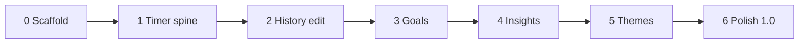

# TrackPay — Execution Plan

**Version:** 0.4.0-plan  
**Status:** ready to build · no app code yet  
**Product lock:** [`PLAN.md`](./PLAN.md)  
**Work orders:** [`phases/`](./phases/README.md)

This is the runbook. Product “what” lives in `PLAN.md`. Agent “how much” lives in `phases/0N-*.md`. This file is **order, contracts, proof, and stop lines**.

---

## Mission

Ship a local-first Material 3 Android pay timer (Clocked In–class) with:

- live `$` on UI + ongoing notification (Android 13+ live status path)
- unlimited jobs, full session edit/create (all free)
- goals funded on clock-out
- insights, streaks, achievements
- cosmetic themes from lifetime earnings
- optional geofence
- **no** billing, widgets, Wear, accounts

**v1 tag:** `1.0.0` after Phase 6 acceptance.

---

## Non-negotiables

| Lock | Value |
|------|--------|
| Name / package | TrackPay / `com.trackpay.app` |
| Stack | Kotlin, Compose, M3, Hilt, Room, DataStore, Nav Compose |
| Module shape | single `app` until pain forces split |
| Money | `Long` minor units |
| Time | UTC epoch millis; display system zone |
| Session | one global active; `Idle → Running ⇄ Paused → Completed` |
| OT v1 | per calendar day per job; default 8h; rates snapshotted at clock-in |
| Earnings | always derived — never trust a stored running total |
| Live `$` | must advance with app closed (FGS + wall-clock recompute) |
| Monetization | none — every feature free |
| Out | widgets, Wear, cloud, ads, IAP |

**Conflict rule:** `phases/0N-*.md` > this file > `PLAN.md` summary bullets.

---

## Critical path (serial)

Phases are **mostly serial** — each mutates the same session pipeline.



| Step | Brief | Ship | Proof |
|-----:|-------|------|-------|
| 0 | [`phases/00-scaffold.md`](./phases/00-scaffold.md) | `0.1.0` | `assembleDebug`; 5 tabs; Verdant dark |
| 1 | [`phases/01-timer-spine.md`](./phases/01-timer-spine.md) | `0.2.0` | clock in/out/pause; notif `$` ticks BG; calculator unit tests |
| 2 | [`phases/02-history-editing.md`](./phases/02-history-editing.md) | `0.3.0` | list/search/filter; manual create/edit/delete |
| 3 | [`phases/03-goals.md`](./phases/03-goals.md) | `0.4.0` | allocate on clock-out; recompute on edit/delete |
| 4 | [`phases/04-insights-motivation.md`](./phases/04-insights-motivation.md) | `0.5.0` | ranges/charts/challenge/streaks/achievements |
| 5 | [`phases/05-themes.md`](./phases/05-themes.md) | `0.6.0` | wallet unlock + apply scheme app-wide |
| 6 | [`phases/06-settings-location-polish.md`](./phases/06-settings-location-polish.md) | `1.0.0` | settings, onboarding, geofence, a11y, notif polish |

Do **not** parallelize 0→6 across agents on one branch — schema/use-case thrash. One phase owner at a time (or stacked PRs that merge in order).

---

## Cross-phase contracts (freeze early)

These names can flex, behavior cannot.

### Pipeline hooks

```
ClockOut
  → write COMPLETED
  → AllocateSession(sessionId)      // Phase 3+; no-op stub OK in 1–2
  → refresh wallet derive            // Phase 5+; derive OK anytime
  → evaluate achievements            // Phase 4+

EditSession / DeleteSession
  → mutate rows
  → RecomputeSession / drop allocations
```

Phase 2 must leave a clear `onSessionMutated(sessionId)` (or equivalent) seam even if empty.

### Calculator

`EarningsCalculator.calculate(session, breaks, now, /* day context */): EarningsBreakdown`

- `activeMinutes`, `regularMinutes`, `otMinutes`, `earnedMinor`
- uses **snapshots**, not live job rates
- excludes open/closed breaks

### Single active session

`ClockIn` fails if any `RUNNING|PAUSED` exists. Manual create = `COMPLETED` only.

### Nav routes (stable from Phase 0)

`dashboard` · `history` · `insights` · `goals` · `settings`  
Secondary: `jobs`, `jobEdit`, `sessionDetail`, `sessionEdit`, `goalEdit`, `themes`, `onboarding`

### Versioning

Every phase exit:

1. `app` `versionName` / `versionCode++`
2. root `VERSION` file matches
3. commit message prefixes `phase-N:`

---

## Package map (target)

```
com.trackpay.app/
  TrackPayApp.kt
  MainActivity.kt
  ui/
    shell/ theme/ components/
    dashboard/ history/ insights/ goals/ settings/
    jobs/ session/ themes/ onboarding/
  domain/
    model/  (Job, WorkSession, BreakInterval, Goal, …)
    calc/   (EarningsCalculator)
    usecase/
  data/
    db/ entity/ dao/
    repo/
    datastore/
  service/  TimerForegroundService
  di/
  location/   (Phase 6)
```

No `billing/`, no `widget/`, no `wear/`.

---

## Build strategy

### Phase 0 — land the runway

- Android Studio / AGP compatible Gradle Kotlin DSL
- Min 26 · compile/target 35
- Hilt + empty Room + DataStore injectable
- M3 Verdant dark + light
- Placeholder tabs only

**Stop line:** app installs and switches tabs. No product logic.

### Phase 1 — spine (highest risk)

Risk concentration: FGS type, notification permission, pay math, process death.

Order inside phase:

1. Entities + DAOs + repos  
2. `EarningsCalculator` + JVM tests  
3. Use cases clock/pause/out  
4. FGS + notification actions  
5. Dashboard UI wired to Flows + 1s ticker  
6. Minimal jobs CRUD  

**Stop line:** background `$` advances; unit tests green; version `0.2.0`.

### Phase 2 — history truth

- Read path for completed sessions  
- Filters/search/totals  
- Manual create + edit (keep snapshots by default; optional “use current job rates”)  
- Mutation hook for Phase 3  

**Stop line:** forgot-to-clock-in user can fix history without a paywall.

### Phase 3 — money with a purpose

- Goals + bps validation (sum ≤ 10000)  
- Allocate on complete; recompute on edit/delete  
- Templates + pace  
- Dashboard goal peek  

**Stop line:** clock-out visibly funds a goal.

### Phase 4 — reason to return

- Aggregations from sessions (not vibes)  
- Vico charts  
- Weekly challenge, streak, achievement catalog  

**Stop line:** Insights non-empty after a few fixture shifts.

### Phase 5 — skin

- Model A unlock: `lifetimeEarned >= unlockMinor`  
- Verdant + Classic Blue free; others gated  
- DataStore `activeThemeId` drives `TrackPayTheme`  

**Stop line:** apply Sunset (once earned) recolors all tabs.

### Phase 6 — ship shape

- Settings IA, currency  
- Onboarding → first job  
- Geofence as **suggest** clock (default), optional hard auto  
- Notif polish + battery backoff  
- a11y + empty states  
- README run instructions  
- version `1.0.0`  

**Stop line:** cold install → onboard → full smoke path permissions-denied still works.

---

## Smoke path (v1 gate)

Run on emulator or device after Phase 6:

1. Fresh install → onboarding → create job @ $25/hr  
2. Clock in → `$` ticks on Dashboard  
3. Leave app → notification `$` still moves  
4. Pause → resume → clock out  
5. History shows session; edit start −15 min → `$` up  
6. Goal 50% → new shift funds goal  
7. Insights 7D/30D render; streak ≥ 1  
8. Themes shows wallet; free theme applies  
9. Deny location; app still fine  
10. Enable location + geofence only if testing that path  

---

## Testing policy

| Layer | When |
|-------|------|
| JVM unit (calc, allocate, streak, unlock) | Phases 1, 3, 4, 5 — required |
| Repo in-memory Room | as needed for filters/mutations |
| `assembleDebug` | every phase |
| Instrumented FGS smoke | Phase 1 nice; Phase 6 required if emulator exists |
| Full lint suite | not a phase gate |

No billing/widget tests. Ever.

---

## Agent / human operating rules

1. **One phase per agent assignment** unless explicitly chaining.  
2. Read only that phase brief + this contracts section + existing code.  
3. Do not “helpfully” add widgets, IAP, Wear, or cloud.  
4. Do not rewrite prior phase UI unless blocked.  
5. If schema must change, update the phase brief handoff note + migrate Room.  
6. Commit at phase boundaries.  
7. Prefer boring APIs over clever abstractions.

### Suggested agent prompts

```
Implement phases/00-scaffold.md only.
Repo: TrackPay. No product features past placeholders.
Prove: assembleDebug. Bump VERSION to 0.1.0.
```

```
Implement phases/01-timer-spine.md only.
Honor EXECUTION.md contracts (calculator, single active session, FGS).
Prove: unit tests + BG notification ticks. VERSION 0.2.0.
```

(Repeat pattern for 02–06.)

---

## Decision log (pre-settled)

| Topic | Decision |
|-------|----------|
| Pro/IAP | removed |
| Widgets / Wear | deferred past 1.0 |
| Theme unlock | Model A — lifetime earned threshold |
| Geofence default | actionable notification; hard auto optional |
| OT scope | per-day per-job v1 |
| Manual sessions | completed only |
| Edit rates | keep snapshots unless user opts into current rates |
| Analytics | off; optional later |
| Charts | Vico |

Open only if blocked in implementation:

- Exact FGS `foregroundServiceType` string Play accepts for timer (decide against current Play docs in Phase 1)
- Live Updates API surface when compile SDK reaches it (Phase 6)

---

## Timeline (effort, not calendar)

Rough relative weight:

| Phase | Weight | Notes |
|------:|--------|-------|
| 0 | 1 | mechanical |
| 1 | 5 | hardest |
| 2 | 3 | |
| 3 | 3 | |
| 4 | 3 | |
| 5 | 2 | |
| 6 | 3 | permissions grind |

Phase 1 slip cascades everything — don’t start 2 until 1’s BG tick is real.

---

## Done means

- [`PLAN.md`](./PLAN.md) v1 done line satisfied  
- Phase 6 checklist complete  
- Smoke path green  
- `VERSION` = `1.0.0`  
- README explains open/run  
- No billing/widget/Wear code in tree  

---

## Changelog

- **0.4.0-plan** — execution runbook: critical path, contracts, smoke gate, agent rules
